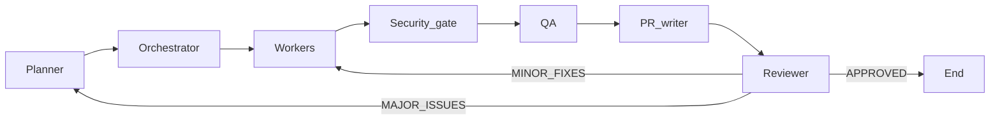

# AI Team Orchestration

This repository uses a **modular, configuration-first** playbook. **Agents** describe roles, **skills** describe reusable capabilities, **rules** encode planning/orchestration/execution logic, and **guardrails** apply global constraints.

---

## Configuration layout

| Layer | Location | Purpose |
|-------|----------|---------|
| **Agents** | [.cursor/agents/](.cursor/agents/) | Role behavior: responsibilities, I/O, constraints (**no skill maps**) |
| **Skills** | [.cursor/skills/](.cursor/skills/) | Reusable capability modules (technologies, patterns, practices) |
| **Rules** | [.cursor/rules/](.cursor/rules/) | Planning, orchestration, and execution policy (`.md`); Cursor auto-rule: [ai-team-orchestration.mdc](.cursor/rules/ai-team-orchestration.mdc) |
| **Guardrails** | [.cursor/guardrails/](.cursor/guardrails/) | Safety and quality limits |

**Routing:** required skills are declared in planning output; **orchestrator** assigns workers using [.cursor/rules/orchestration-rules.md](.cursor/rules/orchestration-rules.md) (single place to extend skill→role defaults).

**Self-healing:** review can route to **targeted worker re-runs** (minor) or **replanner + full orchestration** (major), with iteration caps in [.cursor/guardrails/guardrails.md](.cursor/guardrails/guardrails.md).

---

## Control loop (not strictly linear)

Details: [.cursor/rules/orchestration-rules.md](.cursor/rules/orchestration-rules.md) (repair cases), [.cursor/agents/reviewer-agent.md](.cursor/agents/reviewer-agent.md) (mandatory `REVIEW RESULT` format).

---

## Workflow (primary path)

1. **Planning** — Follow [.cursor/rules/planning-rules.md](.cursor/rules/planning-rules.md) and [.cursor/agents/planner-agent.md](.cursor/agents/planner-agent.md). Output `PLAN:` with **required skills** and dependencies.
2. **Orchestration** — Follow [.cursor/rules/orchestration-rules.md](.cursor/rules/orchestration-rules.md) and [.cursor/agents/orchestrator-agent.md](.cursor/agents/orchestrator-agent.md). Add `Assigned agent:` per task; emit `PARALLEL:` / `SEQUENTIAL:`; enforce **data vs ML vs BI vs security** isolation and the **security-before-QA** gate.
3. **Implementation workers** — `backend-developer`, `frontend-developer`, `data-engineer`, `data-scientist`, `data-analyst` per task, plus [.cursor/rules/execution-rules.md](.cursor/rules/execution-rules.md).
4. **Security gate** — [.cursor/agents/security-engineer.md](.cursor/agents/security-engineer.md) **before QA**; **BLOCKED** stops QA until fixes and re-gate.
5. **QA** — [.cursor/agents/qa-engineer.md](.cursor/agents/qa-engineer.md) only after security **CLEAR**.
6. **PR writing** — [.cursor/agents/pr-writer-agent.md](.cursor/agents/pr-writer-agent.md).
7. **Review** — [.cursor/agents/reviewer-agent.md](.cursor/agents/reviewer-agent.md) → **repair loop** or **end** per review status and guardrails.

---

## Guardrails

See [.cursor/guardrails/guardrails.md](.cursor/guardrails/guardrails.md).

---

## Simplicity rule

Prefer fewer roles, smaller tasks, and true parallelism when dependencies allow. Avoid deep hierarchies and speculative frameworks.

---

## Cursor mapping

Subagents map to the **`Task` tool**. Parallel independent tasks → **multiple `Task` calls in one assistant turn**; dependent tasks → run after upstream results are available.

For trivial, single-file requests, you may shorten ceremony but must still honor **guardrails** and **minimal diffs**.
